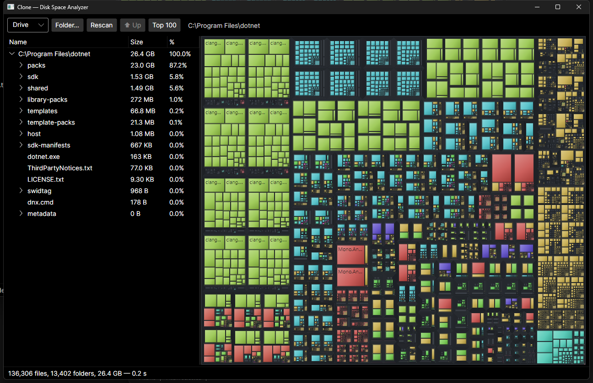

# Clone — Disk Space Analyzer

A lightweight SpaceMonger/TreeSize-style disk space analyzer for Windows, built with .NET 10 and Avalonia. Scans a drive or folder and shows where the space went: a size-sorted folder tree on the left, a squarified treemap on the right, kept in sync both ways.



## Features

- **Fast parallel scanning** — one worker per core over a shared directory queue; a full 1.1M-file `C:\` scan takes ~20 s cold / ~4 s warm. Live file/byte counters while scanning, cancellable at any time.
- **Squarified treemap** (Bruls et al.) — rectangle area ∝ file size, colored by file extension, click to select, double-click to drill in, Up button and breadcrumb to navigate back. Rendering is cached to a bitmap, so hover/selection is instant even on dense views.
- **Size-sorted tree** with size and %-of-parent columns (virtualized `TreeDataGrid`, handles 10k-child folders smoothly).
- **Context menu** — open in Explorer, copy path, delete to Recycle Bin, rescan a single subtree (sizes re-propagate to the root without a full rescan), top-100 files under a folder.
- **Top 100 largest files** — flat list for quick wins, double-click to reveal in Explorer.
- **Safe by construction** — junctions/symlinks are shown but never followed (no cycles, no double-counting); access-denied folders are flagged and counted, never fatal.
- **Headless CLI mode** — `Clone.exe --scan <path>` prints totals without opening a window.

## Requirements

- Windows 10/11 (the scanner and shell integration are Windows-first; the UI stack is cross-platform Avalonia)
- [.NET 10 SDK](https://dotnet.microsoft.com/download/dotnet/10.0) to build; .NET 10 Desktop Runtime to run the framework-dependent build

## Build & run

```powershell
dotnet build -c Release
dotnet run --project Clone.csproj                      # open the UI
dotnet run --project Clone.csproj -- "D:\some\folder"  # open and scan immediately
dotnet run --project Clone.csproj -- --scan "C:\"      # headless: print totals and exit
```

## Publish

Framework-dependent single file (~27 MB, needs the .NET 10 runtime on the target machine):

```powershell
dotnet publish -c Release -r win-x64 --self-contained false /p:PublishSingleFile=true /p:IncludeNativeLibrariesForSelfExtract=true /p:DebugType=none
```

Add `--self-contained true` instead for machines without the runtime (~90 MB). `PublishTrimmed` is not supported by Avalonia — don't enable it.

## Tests

166 tests in three layers, all runnable without elevation:

```powershell
dotnet test
```

| Layer | What it covers |
|---|---|
| Unit (`Clone.Tests/Unit`) | Treemap layout invariants (area conservation, no overlap, proportionality — including seeded property tests over random trees), tree mutations, top-K selection vs a LINQ oracle, formatting, color hashing |
| Integration (`Clone.Tests/Integration`) | The scanner against real temp directories: exact counts, hidden/system files, unicode names, junctions (including a deliberate cycle), deny-ACL folders, cancellation, the `--scan` CLI |
| Headless UI (`Clone.Tests/Headless`) | Avalonia.Headless: treemap hit-testing and mouse events, tree↔treemap selection sync, drill/up navigation, context-menu state, Top-100 window |

The suite never deletes anything it didn't create; fixtures build under `%TEMP%\CloneTests_*` and clean up after themselves (junction-aware, ACE removal before delete). Recycle-bin deletion is intentionally left to manual testing.

## Architecture

```
Program.cs               entry point; --scan CLI mode
Models/FsNode.cs         lean scan-tree node (~70 B + name per entry; millions of files fit in RAM)
Models/FsTreeOps.cs      UI-free tree mutations: delete splice, rescan splice, top-K
Scanning/Scanner.cs      parallel enumerator-based scanner + aggregate/sort post-pass
Scanning/ScanProgress.cs lock-free counters, polled by the UI on a timer
UI/Squarify.cs           pure squarified-treemap layout algorithm
UI/TreemapControl.cs     custom control: cached layout + cached scene bitmap, hit-testing
UI/MainWindow.cs         toolbar, TreeDataGrid, treemap, selection-sync mediator
UI/TopFilesWindow.cs     top-100 largest files list
Util/Format.cs           byte/percent formatting
Util/ShellOps.cs         SHFileOperationW recycle-bin delete, Explorer reveal
```

Design notes:

- **Sizes are apparent sizes** (`FileSystemEntry.Length`), matching Explorer's "Size", not "Size on disk".
- Full paths are never stored — they're rebuilt on demand by walking parent links; the root node holds the absolute path.
- Every `Children` array is kept sorted by size descending; the treemap layout and the tree view both rely on this invariant, and `FsTreeOps` preserves it through every mutation.
- `Avalonia.Controls.TreeDataGrid` is pinned to **11.1.1 — the last MIT-licensed version**. 11.2.0+ requires a commercial AvaloniaUI license; don't bump it casually.
